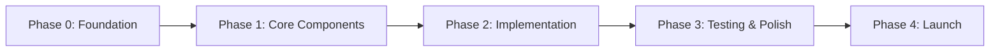

# Business Setup Simplification - Project Roadmap

**Version**: 1.0  
**Created**: December 4, 2025  
**Goal**: Simplify business setup from 7-step wizard to streamlined LEDGERS-style experience  
**Total Estimated Time**: 2.5-3.5 days (Option A) | 2-2.5 days (Option B) | 1-1.5 days (Option C)

---

## 🎯 Project Overview



---

## 📊 Phase Summary

| Phase | Duration | Tasks | Dependencies |
|-------|----------|-------|--------------|
| **Phase 0: Foundation** | 4-6 hours | 5 | None |
| **Phase 1: Core Components** | 8-12 hours | 8 | Phase 0 |
| **Phase 2: Implementation** | 8-16 hours | 10 | Phase 1 |
| **Phase 3: Testing & Polish** | 4-8 hours | 7 | Phase 2 |
| **Phase 4: Launch** | 2-4 hours | 4 | Phase 3 |

**Total**: 28-48 hours (3.5-6 days) - Added modular component development time

---

## 🏛️ Professional Architecture Guidelines

**Core Principle**: **NO MEGA-COMPONENTS** - Every component should have a single, clear responsibility

### Why Modular Architecture Matters

```
❌ BAD: Single 500-line SetupModal component
✅ GOOD: Composed of 20+ focused components (50-150 lines each)
```

**Benefits**:
- ✅ Easier to test (isolated units)
- ✅ Better performance (targeted re-renders)
- ✅ Simpler maintenance (find bugs faster)
- ✅ Team scalability (parallel development)
- ✅ Code reusability (DRY principle)

---

### Architecture Patterns

#### 1. Container/Presentational Pattern

**Containers** (Smart Components - 50-80 lines):
- Connect to context/stores
- Handle data fetching
- Manage local state
- Pass data to presentational components

**Presentational** (Dumb Components - 30-100 lines):
- Receive data via props only
- Focus purely on UI rendering
- No business logic
- Highly reusable

**Example**:
```typescript
// ❌ BAD: Everything in one 300-line component
function SetupModal() {
  const [formData, setFormData] = useState({})
  const [isLoading, setIsLoading] = useState(false)
  // ... 250 more lines
}

// ✅ GOOD: Separated (Container: 60 lines, View: 80 lines)
function SetupModalContainer() {
  const { formData, isLoading, actions } = useSetupForm()
  return <SetupModalView formData={formData} onSubmit={actions.submit} />
}

function SetupModalView({ formData, onSubmit }) {
  return <Dialog><SetupForm data={formData} onSubmit={onSubmit} /></Dialog>
}
```

---

#### 2. Custom Hooks for Logic Extraction

**Extract ALL business logic into hooks**:

```typescript
// ✅ hooks/useSetupForm.ts (100 lines max)
export function useSetupForm() {
  const [formData, setFormData] = useState<FormData>({})
  const validate = useCallback(() => {/* validation */}, [])
  return { formData, actions: { validate, submit } }
}

// Component just renders (50 lines)
function SetupForm() {
  const { formData, actions } = useSetupForm()
  return <form onSubmit={actions.submit}>...</form>
}
```

---

#### 3. Component Size Limits (HARD RULES)

| Metric | Limit | Action if Exceeded |
|--------|-------|-------------------|
| Lines of code | 150 | Split into sub-components |
| Props count | 10 | Group into config object |
| JSX nesting | 3 levels | Extract nested sections |
| useState hooks | 5 | Extract to custom hook |
| useEffect hooks | 3 | Extract to custom hook |

**When to Split**:
- Component > 100 lines → Extract sections
- Repeated JSX → Create shared component
- Complex conditional → Separate component
- Multiple responsibilities → Apply SRP

---

### Modular Component Breakdown

#### SetupModal Architecture (Option A)

```
src/components/portal/business-setup/
├── modal/
│   ├── SetupModal.tsx                    (50 lines - Container)
│   ├── SetupModalHeader.tsx              (30 lines - Country selector)
│   ├── SetupModalFooter.tsx              (40 lines - Terms + Submit)
│   └── SetupModalContent.tsx             (60 lines - Tab wrapper)
├── tabs/
│   ├── ExistingEntityTab/
│   │   ├── index.tsx                     (80 lines - Tab container)
│   │   ├── LicenseInput.tsx              (50 lines - Input + lookup button)
│   │   ├── BusinessNameInput.tsx         (40 lines - Name field)
│   │   └── DepartmentSelector.tsx        (60 lines - Searchable select wrapper)
│   └── NewEntityTab/
│       ├── index.tsx                     (70 lines - Tab container)
│       ├── ProposedNameInput.tsx         (45 lines - Name + validation)
│       └── DepartmentSelector.tsx        (Shared with ExistingEntity)
├── fields/                                (Atomic components)
│   ├── CountryFlagSelector.tsx           (80 lines)
│   ├── TermsCheckbox.tsx                 (50 lines)
│   └── FormField.tsx                     (40 lines - Reusable wrapper)
├── hooks/                                 (Logic layer - NO JSX)
│   ├── useSetupForm.ts                   (100 lines - Form state)
│   ├── useTabNavigation.ts               (50 lines - Tab switching)
│   ├── useLicenseLookup.ts               (80 lines - API integration)
│   └── useFormValidation.ts              (120 lines - Validation)
├── services/                              (API layer - NO React)
│   ├── setupApi.ts                       (80 lines - API calls)
│   ├── validation.ts                     (100 lines - Pure validation)
│   └── transformer.ts                    (60 lines - Data transform)
└── types/
    └── setup.types.ts                    (100 lines - TypeScript)
```

**Total**: ~20 focused files instead of 1 mega-file

---

### Folder Structure Standards

```
src/components/
├── ui/                                    (Shared primitives)
│   ├── SearchableSelect/
│   │   ├── SearchableSelect.tsx          (Main - 80 lines)
│   │   ├── SearchInput.tsx               (Sub-component - 40 lines)
│   │   ├── SearchResults.tsx             (Sub-component - 60 lines)
│   │   ├── useSearch.ts                  (Hook - 70 lines)
│   │   ├── SearchableSelect.test.tsx     (Tests)
│   │   └── index.ts                      (Public API)
│   └── StatusBadge/
│       ├── StatusBadge.tsx               (50 lines)
│       ├── StatusBadge.test.tsx
│       └── index.ts
└── portal/                                (Feature modules)
    ├── business-setup/                    (Feature)
    │   ├── modal/                         (Sub-feature)
    │   ├── tabs/                          (Sub-feature)
    │   ├── fields/                        (Sub-feature)
    │   ├── hooks/                         (Feature hooks)
    │   ├── services/                      (Feature services)
    │   ├── types/                         (Feature types)
    │   └── index.ts                       (Public exports)
    └── dashboard/
        ├── EntityList/
        ├── BusinessActionables/
        └── hooks/
```

---

### Separation of Concerns

| Layer | Responsibilities | ✅ Allowed | ❌ Forbidden |
|-------|-----------------|-----------|--------------|
| **Presentation** | Render UI, handle clicks | JSX, styling, event handlers | API calls, complex logic |
| **Logic (Hooks)** | State, side effects, validation | useState, useEffect, calculations | JSX, CSS-in-JS |
| **Service** | API, localStorage, external | fetch, axios, localStorage | React hooks, JSX |
| **Types** | Interfaces, types, enums | TypeScript definitions | Implementation code |

---

### Testing Strategy

#### Presentational Components
```typescript
// EntityCard.test.tsx (50 lines)
describe('EntityCard', () => {
  it('renders entity name', () => {
    render(<EntityCard entity={mockEntity} />)
    expect(screen.getByText('Test Entity')).toBeInTheDocument()
  })
})
```

#### Custom Hooks
```typescript
// useSetupForm.test.ts (80 lines)
describe('useSetupForm', () => {
  it('validates required fields', () => {
    const { result } = renderHook(() => useSetupForm())
    expect(result.current.errors).toHaveLength(0)
  })
})
```

#### Services
```typescript
// setupApi.test.ts (60 lines)
describe('setupApi', () => {
  it('submits entity data', async () => {
    const response = await setupApi.submitEntity(mockData)
    expect(response.entityId).toBeDefined()
  })
})
```

---

### Performance Optimization

```typescript
// 1. Memoize expensive computations
const sorted = useMemo(
  () => items.sort((a, b) => a.name.localeCompare(b.name)),
  [items]
)

// 2. Memoize callbacks
const handleSubmit = useCallback(
  (data) => submitEntity(data),
  [submitEntity]
)

// 3. Memoize rarely-changing components
const MemoizedCard = memo(EntityCard)

// 4. Lazy load heavy features
const BusinessSetup = lazy(() => import('./business-setup'))

// 5. Virtual scrolling for 100+ items
<VirtualList items={departments} renderItem={(d) => <Item {...d} />} />
```

---

### Code Quality Checklist

**Before Creating Component**:
- [ ] Single responsibility?
- [ ] Under 150 lines?
- [ ] Logic extracted to hook?
- [ ] Testable in isolation?
- [ ] Proper TypeScript types?

**Before Merging PR**:
- [ ] All components < 150 lines
- [ ] No business logic in JSX
- [ ] Custom hooks for stateful logic
- [ ] Services for API calls
- [ ] 70%+ test coverage
- [ ] No prop drilling > 2 levels
- [ ] TypeScript strict mode passing
- [ ] No console.log statements

---

## 🏗️ Phase 0: Foundation (4-6 hours)

**Goal**: Prepare data, utilities, and shared components needed by all options

### Tasks

#### 0.1 UAE Departments Data Structure ⏱️ 1-2 hours
**Priority**: 🔴 Critical  
**Assignee**: Backend/Data Team

**Deliverables**:
- [ ] Create `src/components/portal/business-setup/constants/departments.ts`
- [ ] Add 30+ UAE economic departments/free zones
- [ ] Include metadata (country, category, search keywords)
- [ ] Add Saudi Arabia departments (optional)
- [ ] Add Egypt departments (optional)

**Acceptance Criteria**:
- ✅ Minimum 30 UAE departments
- ✅ Alphabetically sorted
- ✅ TypeScript typed interface
- ✅ Searchable by name

**Data Structure**:
```typescript
export interface EconomicDepartment {
  id: string
  name: string
  country: 'AE' | 'SA' | 'EG'
  category: 'free_zone' | 'mainland' | 'offshore'
  keywords?: string[]
}

export const UAE_DEPARTMENTS: EconomicDepartment[] = [
  { id: 'adafz', name: 'Abu Dhabi Airports Free Zone', country: 'AE', category: 'free_zone' },
  // ... 29+ more
]
```

---

#### 0.2 SearchableSelect Component ⏱️ 2-3 hours
**Priority**: 🔴 Critical  
**Assignee**: Frontend Team  
**Dependencies**: None

**Deliverables**:
- [ ] Create `src/components/ui/searchable-select.tsx`
- [ ] Implement filter-as-you-type
- [ ] Add keyboard navigation (↑↓ arrows, Enter)
- [ ] Highlight matching text
- [ ] Handle 50+ items efficiently
- [ ] Add loading state
- [ ] Add empty state

**Acceptance Criteria**:
- ✅ Filters items in real-time
- ✅ Keyboard accessible
- ✅ Works with 100+ items
- ✅ Mobile responsive

---

#### 0.3 CountryFlagSelector Component ⏱️ 1 hour
**Priority**: 🟡 High  
**Assignee**: Frontend Team  
**Dependencies**: None

**Deliverables**:
- [ ] Create `src/components/portal/business-setup/fields/CountryFlagSelector.tsx`
- [ ] Add flag icons/emojis for UAE, SA, EG
- [ ] Compact dropdown design
- [ ] Header positioning support

**Acceptance Criteria**:
- ✅ Shows flag + country code
- ✅ Fits in modal header
- ✅ Updates form data on change

---

#### 0.4 StatusBadge Component ⏱️ 30 min
**Priority**: 🟡 High  
**Assignee**: Frontend Team  
**Dependencies**: None

**Deliverables**:
- [ ] Create `src/components/ui/status-badge.tsx`
- [ ] Support variants: verification, approved, rejected, pending
- [ ] Match LEDGERS color scheme (yellow, green, red, gray)

**Acceptance Criteria**:
- ✅ 4 variants working
- ✅ Accessible (ARIA labels)
- ✅ Consistent sizing

---

#### 0.5 Update Form Validation Service ⏱️ 30 min
**Priority**: 🟠 Medium  
**Assignee**: Backend Team  
**Dependencies**: Task 0.1

**Deliverables**:
- [ ] Update `validationService.ts` for new data structure
- [ ] Add department field validation
- [ ] Remove step-based logic (if Option A)

**Acceptance Criteria**:
- ✅ Validates required fields
- ✅ Works with new form structure

---

## 🧱 Phase 1: Core Components (8-12 hours)

**Goal**: Build main UI components based on chosen option

### Option A Track: Single-Step Modal (8-10 hours)

#### 1.A.1 Refactor SetupOrchestrator ⏱️ 3-4 hours
**Priority**: 🔴 Critical  
**Dependencies**: Phase 0

**Deliverables**:
- [ ] Remove multi-step wizard logic
- [ ] Add tab navigation (Existing/New Entity)
- [ ] Remove progress indicator
- [ ] Add country selector to header
- [ ] Apply dark modal theme

**Files Modified**:
- `SetupOrchestrator.tsx`
- `SetupContext.tsx`

---

#### 1.A.2 Create ExistingEntityTab ⏱️ 2-3 hours
**Priority**: 🔴 Critical  
**Dependencies**: Task 0.2, 1.A.1

**Deliverables**:
- [ ] Convert `BusinessTypeSelectionStep` to tab
- [ ] Add license number field
- [ ] Add business name field
- [ ] Integrate searchable department dropdown
- [ ] Add terms checkbox
- [ ] Inline validation

**Files**:
- Rename/rewrite `BusinessTypeSelectionStep.tsx` → `ExistingEntityTab.tsx`

---

#### 1.A.3 Create NewEntityTab ⏱️ 1-2 hours
**Priority**: 🔴 Critical  
**Dependencies**: Task 0.2, 1.A.1

**Deliverables**:
- [ ] Proposed name field
- [ ] Department dropdown
- [ ] Terms checkbox

**Files**:
- Create `NewEntityTab.tsx`

---

#### 1.A.4 Remove Unused Step Files ⏱️ 30 min
**Priority**: 🟢 Low  
**Dependencies**: Task 1.A.1-1.A.3

**Deliverables**:
- [ ] Delete 5 step files
- [ ] Update imports

**Files to Delete**:
- `CountrySelectionStep.tsx`
- `BusinessDetailsStep.tsx`
- `DocumentUploadStep.tsx`
- `ReviewConfirmStep.tsx`
- `SubmissionStatusStep.tsx`

---

### Option B Track: 3-Step Wizard (6-8 hours)

#### 1.B.1 Consolidate to 3 Steps ⏱️ 4-5 hours
**Priority**: 🔴 Critical  
**Dependencies**: Phase 0

**Deliverables**:
- [ ] Create `Step1_BasicInfo.tsx` (combines Country + Type + License)
- [ ] Create `Step2_Details.tsx` (combines Details + Department)
- [ ] Keep `Step3_Review.tsx` (existing ReviewConfirm)
- [ ] Update `SetupOrchestrator` STEP_COMPONENTS array

---

### Option C Track: Visual Improvements (4-6 hours)

#### 1.C.1 Apply Dark Modal Theme ⏱️ 2-3 hours
**Priority**: 🔴 Critical  
**Dependencies**: None

**Deliverables**:
- [ ] Update `SetupOrchestrator` styling
- [ ] Dark background, light text
- [ ] Blue accent buttons
- [ ] Update all step components

---

### All Options: Dashboard Components

#### 1.X.1 BusinessActionables Panel ⏱️ 2-3 hours
**Priority**: 🟡 High  
**Dependencies**: Task 0.4

**Deliverables**:
- [ ] Create `src/components/portal/dashboard/BusinessActionables.tsx`
- [ ] Two tabs: Upcoming | Renewals
- [ ] Empty state handling
- [ ] Badge counts

---

#### 1.X.2 Update Portal Dashboard ⏱️ 1-2 hours
**Priority**: 🟡 High  
**Dependencies**: Task 0.4, 1.X.1

**Deliverables**:
- [ ] Add BusinessActionables to right panel
- [ ] Update entity list to show StatusBadge
- [ ] Add tab navigation (Entities/People)
- [ ] Improve search bar

**Files Modified**:
- `src/app/portal/page.tsx`
- `src/components/portal/dashboard/`

---

## 🚀 Phase 2: Implementation (8-16 hours)

**Goal**: Connect components, implement business logic, integrate APIs

### Tasks

#### 2.1 Update SetupContext ⏱️ 2-3 hours
**Priority**: 🔴 Critical  
**Dependencies**: Phase 1

**Deliverables**:
- [ ] Remove step navigation (Option A)
- [ ] Simplify validation logic
- [ ] Update auto-save for new structure
- [ ] Add department field to form data
- [ ] Handle tab switching

**Files**:
- `SetupContext.tsx`

---

#### 2.2 Implement License Lookup Integration ⏱️ 2-3 hours
**Priority**: 🟠 Medium  
**Dependencies**: Task 2.1

**Deliverables**:
- [ ] Update `licenseService.ts` with real API endpoint
- [ ] Add rate limiting (5 req/min)
- [ ] Handle UAE/SA/EG different formats
- [ ] Auto-fill business details on success

**Files**:
- `licenseService.ts`
- `LicenseVerificationStep.tsx` or `ExistingEntityTab.tsx`

---

#### 2.3 Update Entity Setup API Endpoint ⏱️ 3-4 hours
**Priority**: 🔴 Critical  
**Dependencies**: Task 0.1, 2.1

**Deliverables**:
- [ ] Create `/api/portal/entities/setup` endpoint (if not exists)
- [ ] Add server-side validation with Zod
- [ ] Return entity with "PENDING_VERIFICATION" status
- [ ] Send verification email/notification
- [ ] Add CSRF protection

**Files**:
- Create `src/app/api/portal/entities/setup/route.ts`

---

#### 2.4 Update Post-Setup Flow ⏱️ 1 hour
**Priority**: 🔴 Critical  
**Dependencies**: Task 2.3, 1.X.2

**Deliverables**:
- [ ] Change redirect from status page to dashboard
- [ ] Show success toast
- [ ] Ensure new entity appears in list
- [ ] Display "Under Verification" badge

**Files**:
- `SetupOrchestrator.tsx`
- `portal/page.tsx`

---

#### 2.5 Remove Status Page Route ⏱️ 15 min
**Priority**: 🟢 Low  
**Dependencies**: Task 2.4

**Deliverables**:
- [ ] Delete `src/app/portal/business-setup/status/[entityId]/page.tsx`
- [ ] Delete `SubmissionStatusStep.tsx` (if not done)
- [ ] Update navigation

---

#### 2.6 Draft Management ⏱️ 1-2 hours
**Priority**: 🟠 Medium  
**Dependencies**: Task 2.1

**Deliverables**:
- [ ] Update draft schema for new structure
- [ ] Add version check for backwards compatibility
- [ ] Add 7-day expiry to drafts
- [ ] Encrypt sensitive fields (license numbers)

**Files**:
- `draftService.ts`

---

#### 2.7 Error Handling & User Feedback ⏱️ 1-2 hours
**Priority**: 🟡 High  
**Dependencies**: Task 2.3

**Deliverables**:
- [ ] Add error boundary around modal
- [ ] User-friendly error messages
- [ ] Retry mechanisms for API failures
- [ ] Loading states for all async operations

---

## ✨ Phase 3: Testing & Polish (4-8 hours)

**Goal**: Ensure quality, accessibility, and user experience

### Tasks

#### 3.1 Unit Tests ⏱️ 2-3 hours
**Priority**: 🔴 Critical  
**Dependencies**: Phase 2

**Deliverables**:
- [ ] Test SearchableSelect filtering
- [ ] Test form validation
- [ ] Test draft save/load
- [ ] Test API service mocks
- [ ] Achieve 70%+ coverage

**Files to Create**:
- `SearchableSelect.test.tsx`
- `SetupContext.test.tsx`
- `validationService.test.ts`
- `draftService.test.ts`

---

#### 3.2 Integration Tests ⏱️ 1-2 hours
**Priority**: 🟡 High  
**Dependencies**: Task 3.1

**Deliverables**:
- [ ] Test complete setup flow (Existing Entity)
- [ ] Test complete setup flow (New Entity)
- [ ] Test draft resume
- [ ] Test validation blocks submission

---

#### 3.3 Accessibility Audit ⏱️ 1-2 hours
**Priority**: 🟡 High  
**Dependencies**: Phase 2

**Deliverables**:
- [ ] Run axe DevTools scan
- [ ] Add ARIA labels to all interactive elements
- [ ] Test with screen reader (NVDA/JAWS)
- [ ] Ensure keyboard navigation works
- [ ] Add focus indicators

**Tools**: axe DevTools, NVDA

---

#### 3.4 Mobile Responsiveness ⏱️ 1 hour
**Priority**: 🟠 Medium  
**Dependencies**: Phase 2

**Deliverables**:
- [ ] Test on mobile (iPhone, Android)
- [ ] Ensure modal fits on small screens
- [ ] Test searchable dropdown on touch devices
- [ ] Verify tab switching works

---

#### 3.5 Performance Optimization ⏱️ 1 hour
**Priority**: 🟢 Low  
**Dependencies**: Phase 2

**Deliverables**:
- [ ] Add React.memo to step/tab components
- [ ] Optimize SearchableSelect for 100+ items
- [ ] Lazy load department data if large
- [ ] Check bundle size impact

---

#### 3.6 Visual QA ⏱️ 30 min
**Priority**: 🟠 Medium  
**Dependencies**: Phase 2

**Deliverables**:
- [ ] Match LEDGERS visual style
- [ ] Consistent spacing/typography
- [ ] Dark theme applied correctly
- [ ] Status badges match design

---

#### 3.7 User Acceptance Testing ⏱️ 1 hour
**Priority**: 🟡 High  
**Dependencies**: All Phase 3 tasks

**Deliverables**:
- [ ] Test with 2-3 real users
- [ ] Collect feedback on simplified flow
- [ ] Measure completion time
- [ ] Fix critical UX issues

---

## 🚢 Phase 4: Launch (2-4 hours)

**Goal**: Deploy to production safely

### Tasks

#### 4.1 Documentation ⏱️ 1 hour
**Priority**: 🟡 High  
**Dependencies**: Phase 3

**Deliverables**:
- [ ] Update API documentation
- [ ] Create user guide for new flow
- [ ] Document department data structure
- [ ] Add migration notes for existing drafts

---

#### 4.2 Deployment Preparation ⏱️ 30 min
**Priority**: 🔴 Critical  
**Dependencies**: Phase 3

**Deliverables**:
- [ ] Update environment variables (if needed)
- [ ] Run production build locally
- [ ] Verify no console errors
- [ ] Check bundle size

---

#### 4.3 Staged Rollout ⏱️ 1-2 hours
**Priority**: 🔴 Critical  
**Dependencies**: Task 4.2

**Deliverables**:
- [ ] Deploy to staging environment
- [ ] Run smoke tests
- [ ] Deploy to production (10% users)
- [ ] Monitor error logs
- [ ] Gradual rollout to 100%

---

#### 4.4 Post-Launch Monitoring ⏱️ 30 min
**Priority**: 🟡 High  
**Dependencies**: Task 4.3

**Deliverables**:
- [ ] Set up analytics events
- [ ] Track completion rate
- [ ] Monitor API error rates
- [ ] Collect user feedback

---

## 📈 Success Metrics

### KPIs to Track

| Metric | Current | Target | How to Measure |
|--------|---------|--------|----------------|
| **Setup Completion Rate** | ~60% | >85% | Analytics |
| **Average Completion Time** | 3-15 min | <2 min | Analytics |
| **User Drop-off Rate** | ~40% | <15% | Analytics |
| **Modal Abandonment** | Unknown | <20% | Track modal closes without submit |
| **API Error Rate** | Unknown | <1% | Server logs |
| **User Satisfaction** | Unknown | >4/5 | Post-setup survey |

---

## 🎯 Critical Path

```
Phase 0 (Foundation)
  ↓
Task 0.1 (Departments Data) → Task 0.2 (SearchableSelect)
  ↓
Phase 1 (Core Components)
  ↓ 
Task 1.A.1/B.1/C.1 (Main Implementation)
  ↓
Phase 2 (Implementation)
  ↓
Task 2.3 (API Endpoint) → Task 2.4 (Post-Setup Flow)
  ↓
Phase 3 (Testing)
  ↓
Task 3.1 (Unit Tests) → Task 3.3 (Accessibility)
  ↓
Phase 4 (Launch)
```

**Estimated Critical Path Time**: 20-28 hours (2.5-3.5 days)

---

## 🚨 Risk Management

### High-Risk Items

1. **API Integration** (Task 2.2, 2.3)
   - **Risk**: Real license lookup API may not be available
   - **Mitigation**: Keep mock service as fallback, implement manual entry flow

2. **Data Migration** (Task 2.6)
   - **Risk**: Existing localStorage drafts become incompatible
   - **Mitigation**: Version check, clear old drafts with user warning

3. **User Adoption** (Phase 4)
   - **Risk**: Users prefer old 7-step flow
   - **Mitigation**: A/B test, collect feedback, keep rollback option

---

## 📋 Definition of Done

### Phase 0
- ✅ All 5 components created and tested
- ✅ 30+ departments data available

### Phase 1
- ✅ Chosen option (A/B/C) core components built
- ✅ Dashboard updates completed
- ✅ Visual design matches LEDGERS

### Phase 2
- ✅ All business logic implemented
- ✅ API endpoints working (or well-mocked)
- ✅ Post-setup flow redirects correctly

### Phase 3
- ✅ 70%+ test coverage
- ✅ Accessibility audit passed (WCAG 2.1 AA)
- ✅ Mobile responsive verified
- ✅ User acceptance testing completed

### Phase 4
- ✅ Deployed to production
- ✅ Analytics tracking setup
- ✅ No critical bugs in first 24 hours

---

## 🗓️ Recommended Timeline

### Option A: Single-Step Modal (2.5-3.5 days)

**Day 1** (8 hours)
- Morning: Phase 0 (Tasks 0.1-0.5)
- Afternoon: Phase 1 (Tasks 1.A.1-1.A.2)

**Day 2** (8 hours)
- Morning: Phase 1 (Tasks 1.A.3-1.A.4, 1.X.1-1.X.2)
- Afternoon: Phase 2 (Tasks 2.1-2.3)

**Day 3** (8 hours)
- Morning: Phase 2 (Tasks 2.4-2.7)
- Afternoon: Phase 3 (Tasks 3.1-3.4)

**Day 4** (4 hours) - Optional buffer
- Morning: Phase 3 (Tasks 3.5-3.7)
- Afternoon: Phase 4 (All tasks)

---

### Option B: 3-Step Wizard (2-2.5 days)

**Day 1** (8 hours)
- Morning: Phase 0
- Afternoon: Phase 1 (Task 1.B.1)

**Day 2** (8 hours)
- Morning: Phase 1 (Tasks 1.X.1-1.X.2), Phase 2 (Tasks 2.1-2.3)
- Afternoon: Phase 2 (Tasks 2.4-2.7), Phase 3 (Tasks 3.1-3.3)

**Day 3** (4 hours) - Polish & Launch
- Morning: Phase 3 (Tasks 3.4-3.7)
- Afternoon: Phase 4

---

### Option C: Visual Improvements (1-1.5 days)

**Day 1** (8 hours)
- Morning: Phase 0, Phase 1 (Task 1.C.1)
- Afternoon: Phase 1 (Tasks 1.X.1-1.X.2), Phase 2 (Tasks 2.1, 2.3-2.4)

**Day 2** (4 hours) - Testing & Launch
- Morning: Phase 3 (Tasks 3.1, 3.3, 3.6)
- Afternoon: Phase 4

---

## 🎬 Next Steps

1. **Immediate: Choose Implementation Option**
   - Review Options A/B/C with stakeholders
   - Consider trade-offs (speed vs. completeness)
   - Make final decision

2. **Get Approvals**
   - Technical lead sign-off
   - Design team review
   - Product manager approval

3. **Kick Off Development**
   - Assign tasks to team members
   - Set up project tracking (Jira/Linear)
   - Schedule daily standups

4. **Start Phase 0**
   - Begin with Task 0.1 (Departments Data)
   - Parallel work on SearchableSelect (Task 0.2)

---

**Roadmap Version**: 1.0  
**Last Updated**: December 4, 2025  
**Next Review**: After Phase 1 completion
